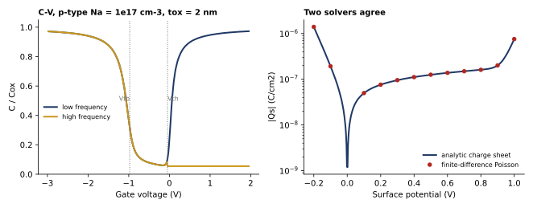
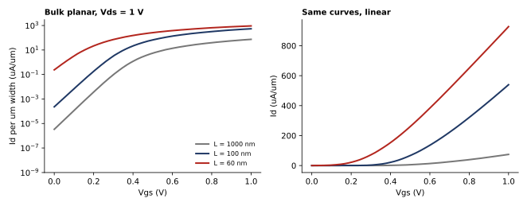
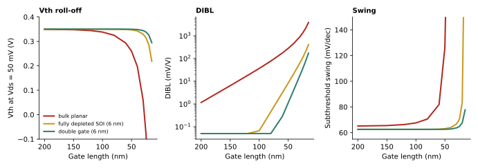

# MOSFET Device Models: MOS Capacitor to Short-Channel Scaling

[](https://github.com/fatinnihal532-hub/mosfet-device-models/actions/workflows/ci.yml)
[](https://colab.research.google.com/github/fatinnihal532-hub/mosfet-device-models/blob/main/run_in_colab.ipynb)

A small Python library that builds a MOSFET from the physics up. It solves the MOS capacitor exactly, checks
that solution against an independent numerical Poisson solver, then feeds the result into a compact drain
current model with a short-channel correction. Extraction routines then pull threshold voltage, subthreshold
swing and DIBL from the simulated curves, the way a device engineer would from measurements. The last study asks
why planar bulk transistors stopped scaling and how thin-body and multi-gate structures fix it.

It is the device-physics counterpart to my GaN HEMT TCAD work, and it runs anywhere with no licence.

## 1. The MOS capacitor



For a p-type substrate (Na = 1e17 cm-3, 2 nm oxide, n+ gate) the surface potential follows from the exact
1-D charge-sheet relation, and the gate voltage is `Vg = Vfb + psi_s - Qs/Cox`. From that the code gives:

* Vfb = -0.977 V, Vth = -0.047 V, maximum depletion width 103.8 nm
* the low-frequency C-V (inversion charge follows the gate) and the high-frequency C-V (it does not, so the
  depletion width freezes and C falls to Cmin = 0.055 Cox)
* an independent check: a Newton-solved finite-difference Poisson equation on a graded grid matches the analytic
  charge to better than 0.03% across accumulation, depletion and inversion

## 2. The transistor



The drain current uses one charge-based expression (an EKV-style interpolation) that is continuous from weak to
strong inversion, with mobility degradation and a velocity-saturation limit. Its limits are tested against
hand formulas: the long-channel square law in saturation, `beta*Vov*Vds` in the linear region, and a weak-inversion
swing of exactly `n*kT/q*ln10`. The gate work function is set so the long-channel threshold is 0.35 V.

## 3. Why planar bulk stops scaling



Short-channel behaviour comes from a 2-D scale-length correction. The threshold drops by
`[2(Vbi - 2phiF) + Vds] / (2cosh(L/2lambda) - 2)`, where the natural length `lambda` is set by oxide thickness
and by the depletion depth (bulk) or body thickness (thin-body). This is a compact approximation, not a full 2-D
simulation, and the body factor of the fully depleted devices is an assumed constant.

| Gate length | Structure | DIBL (mV/V) | Swing (mV/dec) | Ioff (nA/um) |
|---|---|---|---|---|
| 100 nm | bulk planar | 36.6 | 67.6 | 0.23 |
| 60 nm | bulk planar | 174.8 | 81.9 | 238 |
| 30 nm | bulk planar | 894.6 | 1295 | over 9e5 (gate control lost) |
| 30 nm | fully depleted SOI, 6 nm body | 62.5 | 66.7 | 1.5 |
| 30 nm | double gate, 6 nm body | 17.4 | 63.7 | 0.12 |
| 20 nm | double gate, 6 nm body | 75.4 | 67.7 | 3.9 |

The trend is what matters. The 49 nm depletion depth of the bulk device sets a 15 nm scale length, so control
fails below about 60 nm. A 6 nm body brings the scale length to 5 nm (single gate) or 4 nm (double gate), and
the same swing survives down to about 20 nm. This is the argument behind FD-SOI and FinFETs. The full table is in
[`results/scaling.csv`](results/scaling.csv).

## How the results are checked

`python verify.py` runs 10 checks and `pytest` runs 22 tests:

* exact charge sheet at `psi_s = 2phiF` reproduces the depletion-approximation threshold to 1e-6 V
* analytic and finite-difference Poisson charge agree at 24 surface potentials
* C-V limits: Cox in accumulation and low-frequency inversion, Cmin at high frequency, the flat-band capacitance
  formula within 2%
* transistor limits against the square law, the linear-region formula and `n*kT/q*ln10`
* drain current is monotonic in Vgs and Vds, and reverses sign with the drain
* roll-off and DIBL grow as L shrinks, and bulk is worse than SOI, which is worse than double gate

## Run it

```bash
pip install -r requirements.txt
python -m pytest -q
python verify.py
python make_figures.py    # docs/*.svg and results/scaling.csv
```

```python
from mosdev import MOSFET, MOSCap, extract
m = MOSFET(w_um=1.0, l_nm=60, arch="dg", tsi_nm=6)   # arch: "bulk", "soi" or "dg"
print(m.vth(0.05), m.id(1.0, 1.0))
```

## Layout

```
mosdev/moscap.py    exact surface-potential model, C-V, finite-difference Poisson solver
mosdev/mosfet.py    compact drain-current model, scale-length short-channel correction
mosdev/extract.py   Vth (gm-max, constant current), swing, DIBL
verify.py           checks behind every number in this README
make_figures.py     figures and the scaling table
```

---
Fatin Nihal Islam · EEE, KUET · [Portfolio](https://fatinnihal532-hub.github.io) · [LinkedIn](https://www.linkedin.com/in/fatin-nihal-islam2002)
